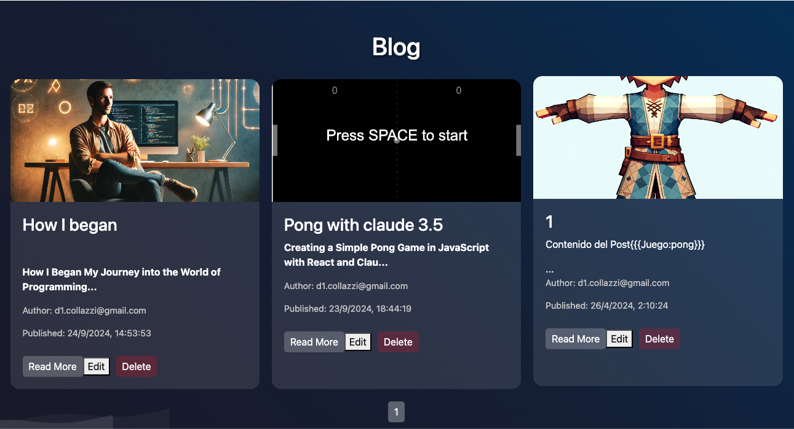

# petalo9.com-Frontend

This is the source code for my personal website, **petalo9.com**, which features a blog, a selection of games, and more. The frontend is built using **React**, **CSS**, and other modern web technologies. The website is designed to showcase my projects, share insights through the blog, and provide interactive games.

## Features

- **Blog**: A dynamic blog where I share articles on various topics related to technology and programming.
- **Games**: Several games embedded into the site, developed using **React** and custom shaders.
- **Responsive Design**: The site is fully responsive and optimized for both desktop and mobile devices.
- **Tech Stack**: Built with **React**, **JavaScript**, **CSS**, and **Node.js**.

## Available Scripts

In the project directory, you can run:

### `npm start`

Runs the app in the development mode.\
Open [http://localhost:3000](http://localhost:3000) to view it in your browser.

The page will reload when you make changes.\
You may also see any lint errors in the console.

### `npm test`

Launches the test runner in the interactive watch mode.\
See the section about [running tests](https://facebook.github.io/create-react-app/docs/running-tests) for more information.

### `npm run build`

Builds the app for production to the `build` folder.\
It correctly bundles React in production mode and optimizes the build for the best performance.

The build is minified and the filenames include the hashes.\
Your app is ready to be deployed!

See the section about [deployment](https://facebook.github.io/create-react-app/docs/deployment) for more information.

## Learn More

You can learn more in the [Create React App documentation](https://facebook.github.io/create-react-app/docs/getting-started).

To learn React, check out the [React documentation](https://reactjs.org/).

## Deployment

The project is deployed using standard methods outlined in the [Create React App deployment guide](https://facebook.github.io/create-react-app/docs/deployment).

---

**Check out the repository on GitHub**: [petalo9.com-Frontend](https://github.com/PitiGo/petalo9.com-Frontend)